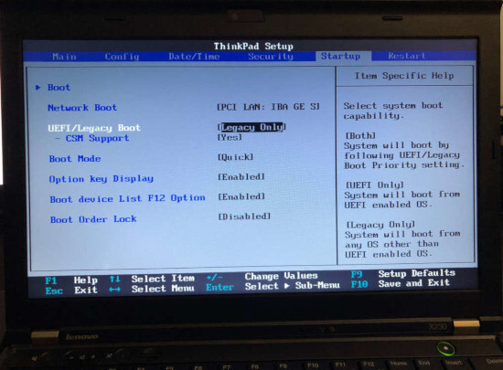
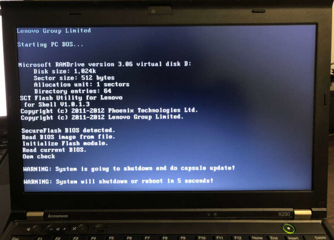
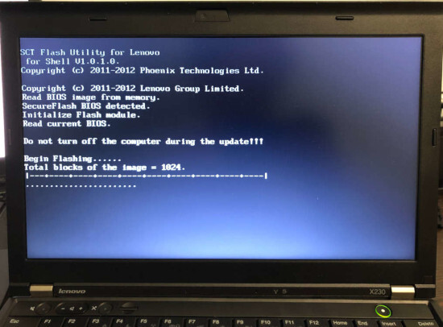
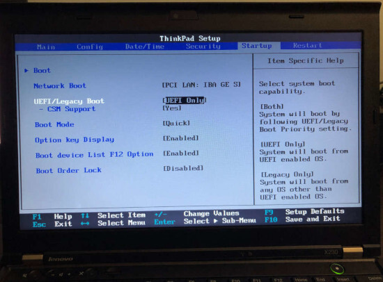

# Ivy Bridge Lenovo ThinkPad Internal Flashing

## Introduction

Old versions of stock BIOS for these models have several security issues.
In order to flash coreboot internally, two of them are of interest.

**First** is the fact the `SMM_BWP` and `BLE` are not enabled in BIOS
versions released before 2014. We have tested many versions on T430 and
X230 and found out that `SMM_BWP=1` only since the update, the changelog
of which contains following line:

> (New) Improved the UEFI BIOS security feature.

**Second** is [S3 Boot Script vulnerability](https://support.lenovo.com/eg/ru/product_security/s3_boot_protect),
that was discovered and fixed later.

## Requirements

- USB drive (in case you need to downgrade BIOS)
- Linux install that (can be) loaded in UEFI mode
```{toctree}
:maxdepth: 1

CHIPSEC <https://github.com/chipsec/chipsec>
```

## BIOS versions

Below is a table of BIOS versions that are vulnerable enough for our
goals, per model. The version number means that you need to downgrade to
that or earlier version.

```{eval-rst}
+------------+--------------+
| Model      | BIOS version |
+============+==============+
| X230       | 2.60         |
+------------+--------------+
| X230T      | 2.58         |
+------------+--------------+
| T430       | 2.64         |
+------------+--------------+
| T430s      | 2.59         |
+------------+--------------+
| T530       | 2.60         |
+------------+--------------+
| W530       | 2.58         |
+------------+--------------+
```

If your BIOS version is equal or lower, skip to the
**[Examining protections](#examining-protections-theory)** section. If not,
go through the downgrade process, described next.

## Downgrading BIOS

Go to the Lenovo web site and download BIOS Update Bootable CD for your
machine of needed version (see above).

Lenovo states that BIOS has "security rollback prevention", meaning once
you update it to some version X, you will not be able to downgrade it to
pre-X version. That's not true. It seems that this is completely
client-side restriction in flashing utilities (both Windows utility and
Bootable CD). You just need to call `winflash.exe` or `dosflash.exe`
directly. Therefore you need to modify the bootable CD image you just
downloaded.

Extract an El Torito image:

    geteltorito -o ./bios.img g1uj41us.iso

Mount the partition in that image:

    sudo mount -t vfat ./bios.img /mnt -o loop,offset=16384

List files, find the `AUTOEXEC.BAT` file and the `FLASH` directory:

    ls /mnt
    ls /mnt/FLASH

Inside the `FLASH` directory, there should be a directory called
`G1ET93WW` or similar (exact name depends on your ThinkPad model and
BIOS version). See what's inside:

    ls /mnt/FLASH/G1ET93WW

There must be a file with `.FL1` extension called `$01D2000.FL1` or
something similar.

Now open the `AUTOEXEC.BAT` file:

    sudo vim /mnt/AUTOEXEC.BAT

You will see a list of commands:

    @ECHO OFF
    PROMPT $p$g
    cd c:\flash
    command.com

Replace the last line (`command.com`) with this (change path to the
`.FL1` file according to yours):

    dosflash.exe /sd /file G1ET93WW\$01D2000.FL1

Save the file, then unmount the partition:

    sudo umount /mnt

Write this image to a USB drive (replace `/dev/sdX` with your USB drive
device name):

    sudo dd if=./bios.img of=/dev/sdX bs=1M

Now reboot and press F1 to enter BIOS settings. Open the **Startup** tab
and set the startup mode to **Legacy** (or **Both**/**Legacy First**):



Press F10 to save changes and reboot.

Now, before you process, make sure that AC adapter is connected! If your
battery will die during the process, you'll likely need external
programmer to recover.

Boot from the USB drive (press F12 to select boot device), and BIOS
flashing process should begin:





It may reboot a couple of times in the process. Do not interrupt it.

When it's completed, go back to the BIOS settings and set startup mode
to **UEFI** (or **Both**/**UEFI First**). This is required for
vulnerability exploitation.



Then boot to your system and make sure that `/sys/firmware/efi` or
`/sys/firmware/efivars` exist.

## Examining protections (theory)

There are two main ways that Intel platform provides to protect BIOS
chip:
- **BIOS_CNTL** register of LPC Interface Bridge Registers (accessible
    via PCI configuration space, offset 0xDC). It has:
  * **SMM_BWP** (*SMM BIOS Write Protect*) bit. If set to 1, the BIOS is
    writable only in SMM. Once set to 1, cannot be changed anymore.
  * **BLE**  (*BIOS Lock Enable*) bit. If set to 1, setting BIOSWE to 1
    will raise SMI. Once set to 1, cannot be changed anymore.
  * **BIOSWE** (*BIOS Write Enable*) bit. Controls whether BIOS is
    writable. This bit is always R/W.
- SPI Protected Range Registers (**PR0**-**PR4**) of SPI Configuration
  Registers (SPIBAR+0x74 - SPIBAR+0x84). Each register has bits that
  define protected range, plus WP bit, that defines whether write
  protection is enabled.

  There's also **FLOCKDN** bit of HSFS register (SPIBAR+0x04) of SPI
  Configuration Registers. When set to 1, PR0-PR4 registers cannot be
  written. Once set to 1, cannot be changed anymore.

To be able to flash, we need `SMM_BWP=0`, `BIOSWE=1`, `BLE=0`, `FLOCKDN=0` or
SPI protected ranges (PRx) to have a WP bit set to 0.

Let's see what we have. Examine `HSFS` register:

    sudo chipsec_main -m chipsec.modules.common.spi_lock

You should see that `FLOCKDN=1`:

    [x][ =======================================================================
    [x][ Module: SPI Flash Controller Configuration Locks
    [x][ =======================================================================
    [*] HSFS = 0xE009 << Hardware Sequencing Flash Status Register (SPIBAR + 0x4)
        [00] FDONE            = 1 << Flash Cycle Done
        [01] FCERR            = 0 << Flash Cycle Error
        [02] AEL              = 0 << Access Error Log
        [03] BERASE           = 1 << Block/Sector Erase Size
        [05] SCIP             = 0 << SPI cycle in progress
        [13] FDOPSS           = 1 << Flash Descriptor Override Pin-Strap Status
        [14] FDV              = 1 << Flash Descriptor Valid
        [15] FLOCKDN          = 1 << Flash Configuration Lock-Down

Then check `BIOS_CNTL` and PR0-PR4:

    sudo chipsec_main -m common.bios_wp

Good news: on old BIOS versions, `SMM_BWP=0` and `BLE=0`.

Bad news: there are 4 write protected SPI ranges:

     [x][ =======================================================================
     [x][ Module: BIOS Region Write Protection
     [x][ =======================================================================
     [*] BC = 0x 8 << BIOS Control (b:d.f 00:31.0 + 0xDC)
         [00] BIOSWE           = 0 << BIOS Write Enable
         [01] BLE              = 0 << BIOS Lock Enable
         [02] SRC              = 2 << SPI Read Configuration
         [04] TSS              = 0 << Top Swap Status
         [05] SMM_BWP          = 0 << SMM BIOS Write Protection
     [-] BIOS region write protection is disabled!

     [*] BIOS Region: Base = 0x00500000, Limit = 0x00BFFFFF
     SPI Protected Ranges
     ------------------------------------------------------------
     PRx (offset) | Value    | Base     | Limit    | WP? | RP?
     ------------------------------------------------------------
     PR0 (74)     | 00000000 | 00000000 | 00000000 | 0   | 0
     PR1 (78)     | 8BFF0B40 | 00B40000 | 00BFFFFF | 1   | 0
     PR2 (7C)     | 8B100B10 | 00B10000 | 00B10FFF | 1   | 0
     PR3 (80)     | 8ADE0AD0 | 00AD0000 | 00ADEFFF | 1   | 0
     PR4 (84)     | 8AAF0800 | 00800000 | 00AAFFFF | 1   | 0

Other way to examine SPI configuration registers is to just dump SPIBAR:

    sudo chipsec_util mmio dump SPIBAR

You will see `SPIBAR` address (0xFED1F800) and registers (for example,
`00000004` is `HSFS`):

    [mmio] MMIO register range [0x00000000FED1F800:0x00000000FED1F800+00000200]:
    +00000000: 0BFF0500
    +00000004: 0004E009
    ...

As you can see, the only thing we need is to unset WP bit on PR0-PR4.
But that cannot be done once `FLOCKDN` is set to 1.

Now the fun part!

`FLOCKDN` may only be cleared by a hardware reset, which includes S3
state. On S3 resume boot path, the chipset configuration has to be
restored and it's done by executing so-called S3 Boot Scripts. You can
dump these scripts by executing:

    sudo chipsec_util uefi s3bootscript

There are many entries. Along them, you can find instructions to write
to `HSFS` (remember, we know that `SPIBAR` is 0xFED1F800):

     Entry at offset 0x2B8F (len = 0x17, header len = 0x0):
     Data:
     02 00 17 02 00 00 00 01 00 00 00 04 f8 d1 fe 00 |
     00 00 00 09 e0 04 00                            |
     Decoded:
       Opcode : S3_BOOTSCRIPT_MEM_WRITE (0x0002)
       Width  : 0x02 (4 bytes)
       Address: 0xFED1F804
       Count  : 0x1
       Values : 0x0004E009

These scripts are stored in memory. The vulnerability is that we can
overwrite this memory, change these instructions and they will be
executed on S3 resume. Once we patch that instruction to not set `FLOCKDN`
bit, we will be able to write to PR0-PR4 registers.

## Creating a backup

Before you proceed, please create a backup of the `bios` region. Then,
in case something goes wrong, you'll be able to flash it back externally.

The `me` region is locked, so an attempt to create a full dump will fail.
But you can back up the `bios`:

    sudo flashrom -p internal -r bios_backup.rom --ifd -i bios

If you will ever need to flash it back, use `--ifd -i bios` as well:

    sudo flashrom -p <YOUR_PROGRAMMER> -w bios_backup.rom --ifd -i bios

**Caution:** if you will omit `--ifd -i bios` for flashing, you will
brick your machine, because your backup has `FF`s in place of `fd` and
`me` regions. Flash only `bios` region!

## Removing protections (practice)

The original boot script writes 0xE009 to `HSFS`. `FLOCKDN` is 15th bit, so
let's write 0x6009 instead:

    sudo chipsec_main -m tools.uefi.s3script_modify -a replace_op,mmio_wr,0xFED1F804,0x6009,0x2

You will get a lot of output and in the end you should see something
like this:

     [*] Modifying S3 boot script entry at address 0x00000000DAF49B8F..
     [mem] 0x00000000DAF49B8F
     [*] Original entry:
      2  0 17  2  0  0  0  1  0  0  0  4 f8 d1 fe  0 |
      0  0  0  9 e0  4  0                            |
     [mem] buffer len = 0x17 to PA = 0x00000000DAF49B8F
      2  0 17  2  0  0  0  1  0  0  0  4 f8 d1 fe  0 |
      0  0  0  9 60  0  0                            |     `
     [mem] 0x00000000DAF49B8F
     [*] Modified entry:
      2  0 17  2  0  0  0  1  0  0  0  4 f8 d1 fe  0 |
      0  0  0  9 60  0  0                            |     `
     [*] After sleep/resume, check the value of register 0xFED1F804 is 0x6009
     [+] PASSED: The script has been modified. Go to sleep..

Now go to S3, then resume and check `FLOCKDN`. It should be 0:

    sudo chipsec_main -m chipsec.modules.common.spi_lock

    ...
    [x][ =======================================================================
    [x][ Module: SPI Flash Controller Configuration Locks
    [x][ =======================================================================
    [*] HSFS = 0x6008 << Hardware Sequencing Flash Status Register (SPIBAR + 0x4)
        [00] FDONE            = 0 << Flash Cycle Done
        [01] FCERR            = 0 << Flash Cycle Error
        [02] AEL              = 0 << Access Error Log
        [03] BERASE           = 1 << Block/Sector Erase Size
        [05] SCIP             = 0 << SPI cycle in progress
        [13] FDOPSS           = 1 << Flash Descriptor Override Pin-Strap Status
        [14] FDV              = 1 << Flash Descriptor Valid
        [15] FLOCKDN          = 0 << Flash Configuration Lock-Down
    [-] SPI Flash Controller configuration is not locked
    [-] FAILED: SPI Flash Controller not locked correctly.
    ...

Remove WP from protected ranges:

    sudo chipsec_util mmio write SPIBAR 0x74 0x4 0xAAF0800
    sudo chipsec_util mmio write SPIBAR 0x78 0x4 0xADE0AD0
    sudo chipsec_util mmio write SPIBAR 0x7C 0x4 0xB100B10
    sudo chipsec_util mmio write SPIBAR 0x80 0x4 0xBFF0B40

Verify that it worked:

    sudo chipsec_main -m common.bios_wp

    [x][ =======================================================================
    [x][ Module: BIOS Region Write Protection
    [x][ =======================================================================
    [*] BC = 0x 9 << BIOS Control (b:d.f 00:31.0 + 0xDC)
        [00] BIOSWE           = 1 << BIOS Write Enable
        [01] BLE              = 0 << BIOS Lock Enable
        [02] SRC              = 2 << SPI Read Configuration
        [04] TSS              = 0 << Top Swap Status
        [05] SMM_BWP          = 0 << SMM BIOS Write Protection
    [-] BIOS region write protection is disabled!

    [*] BIOS Region: Base = 0x00500000, Limit = 0x00BFFFFF
    SPI Protected Ranges
    ------------------------------------------------------------
    PRx (offset) | Value    | Base     | Limit    | WP? | RP?
    ------------------------------------------------------------
    PR0 (74)     | 0AAF0800 | 00800000 | 00AAF000 | 0   | 0
    PR1 (78)     | 0ADE0AD0 | 00AD0000 | 00ADE000 | 0   | 0
    PR2 (7C)     | 0B100B10 | 00B10000 | 00B10000 | 0   | 0
    PR3 (80)     | 0BFF0B40 | 00B40000 | 00BFF000 | 0   | 0
    PR4 (84)     | 00000000 | 00000000 | 00000000 | 0   | 0

Bingo!

Now you can [flash internally]. Remember to flash only the `bios` region
(use `--ifd -i bios -N` flashrom arguments). `fd` and `me` are still
locked.

Note that you should have an external SPI programmer as a backup method.
It will help you recover if you flash non-working ROM by mistake.


[flash internally]: ../../tutorial/flashing_firmware/int_flashrom.md
