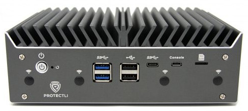
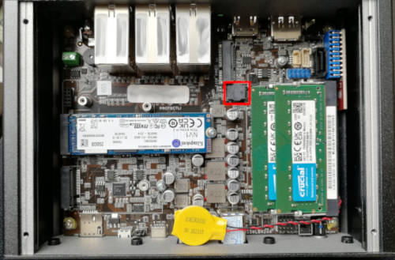

# Protectli Vault VP46xx series

This page describes how to run coreboot on the [Protectli VP46xx].




## Required proprietary blobs

To build a minimal working coreboot image some blobs are required (assuming
only the BIOS region is being modified).

```{eval-rst}
+-----------------+---------------------------------+---------------------+
| Binary file     | Apply                           | Required / Optional |
+=================+=================================+=====================+
| FSP-M, FSP-S    | Intel Firmware Support Package  | Required            |
+-----------------+---------------------------------+---------------------+
| microcode       | CPU microcode                   | Required            |
+-----------------+---------------------------------+---------------------+
```

FSP-M and FSP-S are obtained after splitting the Comet Lake FSP binary (done
automatically by the coreboot build system and included into the image) from
the `3rdparty/fsp` submodule. VP4630 and VP4650 use CometLake2 FSP and VP4670
use CometLake1 FSP (see [variants](#variants) section), so be sure to select
the correct board in the coreboot's menuconfig, otherwise the platform will not
succeed on memory initialization.

Microcode updates are automatically included into the coreboot image by build
system from the `3rdparty/intel-microcode` submodule.

## Flashing coreboot

### Internal programming

The main SPI flash can be accessed using [flashrom]. The first version
supporting the chipset is flashrom v1.2. Firmware an be easily flashed
with internal programmer (either BIOS region or full image).

### External programming

The system has an internal flash chip which is a 16 MiB socketed SOIC-8 chip.
This chip is located on the top side of the case (the lid side). One has to
remove 4 top cover screws and lift up the lid. The flash chip is near the M.2
WiFi slot connector. Remove the chip from socket and use a clip to program the
chip. Specifically, it's a KH25L12835F (3.3V) which is a clone of Macronix
MX25L12835F - [datasheet][MX25L12835F].



## Known issues

- After flashing with external programmer it is always required to reset RTC
  with a jumper or disconnect the coin cell temporarily. Only then the platform
  will boot after flashing.

## Working

- USB 3.0 front ports (SeaBIOS, Tianocore UEFIPayload and Linux)
- 6 Ethernet ports
- HDMI, DisplayPort and USB-C Display Port with libgfxinit and FSP GOP
- flashrom
- M.2 WiFi
- M.2 4G LTE
- M.2 SATA and NVMe
- 2.5'' SATA SSD
- eMMC
- Super I/O serial port 0 via front microUSB connector (Fintek F81232 USB to
  UART adapter present on board)
- SMBus (reading SPD from DIMMs)
- Initialization with CometLake FSP 2.0
- SeaBIOS payload (version rel-1.16.0)
- TianoCore UEFIPayload
- LPC TPM module (using Protectli custom-designed module with Infineon SLB9660)
- Reset switch
- Booting Debian, Ubuntu, FreeBSD

## Variants

There are 3 variants of VP46xx boards: VP4630, VP4650 and VP4670. They differ
only in used SoC and some units may come with different Super I/O chips, either
ITE IT8786E or IT8784E, but the configuration is the same on this platform.

- VP4630:

```{eval-rst}
+------------------+--------------------------------------------------+
| CPU              | Intel Core i3-10110U                             |
+------------------+--------------------------------------------------+
| PCH              | Intel Comet Lake U Premium                       |
+------------------+--------------------------------------------------+
| Super I/O, EC    | ITE IT8786E/IT8784E                              |
+------------------+--------------------------------------------------+
| Coprocessor      | Intel Management Engine                          |
+------------------+--------------------------------------------------+
```

- VP4650:

```{eval-rst}
+------------------+--------------------------------------------------+
| CPU              | Intel Core i5-10210U                             |
+------------------+--------------------------------------------------+
| PCH              | Intel Comet Lake U Premium                       |
+------------------+--------------------------------------------------+
| Super I/O, EC    | ITE IT8786E/IT8784E                              |
+------------------+--------------------------------------------------+
| Coprocessor      | Intel Management Engine                          |
+------------------+--------------------------------------------------+
```

- VP4670:

```{eval-rst}
+------------------+--------------------------------------------------+
| CPU              | Intel Core i7-10810U                             |
+------------------+--------------------------------------------------+
| PCH              | Intel Comet Lake U Premium                       |
+------------------+--------------------------------------------------+
| Super I/O, EC    | ITE IT8786E/IT8784E                              |
+------------------+--------------------------------------------------+
| Coprocessor      | Intel Management Engine                          |
+------------------+--------------------------------------------------+
```

## Useful links

```{toctree}
:maxdepth: 1

VP4600 Hardware Overview <https://protectli.com/kb/vp4600-hardware-overview/>
VP4630 Product Page <https://protectli.com/product/vp4630/>
Protectli TPM module <https://protectli.com/product/tpm-module/>
```

[Protectli VP46xx]: https://protectli.com/vault-6-port/
[MX25L12835F]: https://www.mxic.com.tw/Lists/Datasheet/Attachments/8653/MX25L12835F,%203V,%20128Mb,%20v1.6.pdf
[flashrom]: https://flashrom.org/Flashrom
